## 🌟 Hi! There!

## **[简体中文](./README_zh.md "你好呀！")**

You can call me **Chris233**, **Chris** or *Whatever you want*! 🌈

**16** years old.

  

Learning English so that I may use it very much for practicing.
Please please ignore my poor grammar (⋟﹏⋞) 

### 🛠️ What I'm using or learning: ~~(and unused)~~

### 🎯 Coding style
Three important parts for me in coding:
1. **Memory safe**. (Rust is my best friend!)
2. *Runtime* speed. (I like optimizing for old devices!)
3. No warnings. (Especially on main branch!)

> Errors should be thrown out, not hidden.

### 📊 GitHub Stats & Activity

  
<!---

--->

### 🐍 My Contribution Snake

Your moves show others I'm alive! 🎉

<picture>
  <source media="(prefers-color-scheme: dark)" srcset="https://raw.githubusercontent.com/H-Chris233/H-Chris233/output/github-contribution-grid-snake-dark.svg">
  <source media="(prefers-color-scheme: light)" srcset="https://raw.githubusercontent.com/H-Chris233/H-Chris233/output/github-contribution-grid-snake.svg">
  
</picture>

### 🌈 Fun Fact
> 🐟🧠→🦅!

<!---
创造你的时候
神开了个玩笑
从此你灵魂滚烫
命运冰凉

你踏入这世界
在人群中犹如孤岛
于是
成长像是迷雾中的蹒跚
在风暴里聆听呢喃
猜测前进的方向

就这样
你两次学习如何生活
又经历两次死亡
临终时
你还剩下两个问题
首先
两个矛盾的梦如何被安放
然后
这些经历，回忆和梦究竟有什么意义
--->
