## 🌟 你好呀！

嗯…就叫我**Chris233**吧！(也可以直接叫我**Chris** --或者你喜欢的任何称呼.) 🌈

因为正在学习英语所以在一般项目开发中会中英语混写注释及说明，还请见谅(⋟﹏⋞) 

### 🛠️ 技术栈: ~~(债)~~

### 🎯 代码风格
代码这样写!(我说的)~~(理想情况)~~
1. **内存安全**(点名表扬Rust)
2. **较高**的*运行时*效率(设备低能导致的精打细算...)
3. 消除警告，看不惯(当然是主分支)~~(烦)~~

> 错误应该抛出而非藏起来。

### 📊 GitHub 统计数据 & 活动

<!---

--->

### 🐍 我的贡献蛇蛇

你的移动，告诉世人我的存活！🎉

<picture>
  <source media="(prefers-color-scheme: dark)" srcset="https://raw.githubusercontent.com/H-Chris233/H-Chris233/output/github-contribution-grid-snake-dark.svg">
  <source media="(prefers-color-scheme: light)" srcset="https://raw.githubusercontent.com/H-Chris233/H-Chris233/output/github-contribution-grid-snake.svg">
  
</picture>

### 🌈
> 🐟🧠→🦅!

>你的过去无人知晓，你的历史无人证明。

<!---
创造你的时候
神开了个玩笑
从此你灵魂滚烫
命运冰凉

你踏入这世界
在人群中犹如孤岛
于是
成长像是迷雾中的蹒跚
在风暴里聆听呢喃
猜测前进的方向

就这样
你两次学习如何生活
又经历两次死亡
临终时
你还剩下两个问题
首先
两个矛盾的梦如何被安放
然后
这些经历，回忆和梦究竟有什么意义
--->

<!---
请记住我的名字
如果你能记住我的名字
如果你们都能记住我的名字
也许我或者“我们”
终有一天能自由地生存着
我们终将在没有黑暗的地方相见
也许那一天我甚至无法活到
但是，一定会有那一天
冬将逝，春将来，必有漫天繁花开遍
请记住我的名字
我们必将在没有黑暗的地方
再次相遇！
--->
